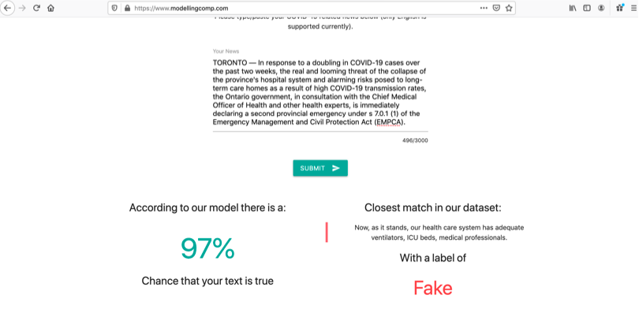
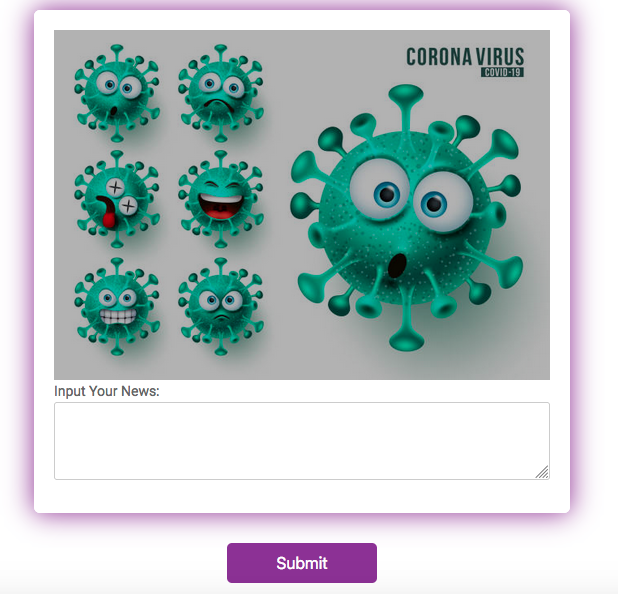

# Flask_project

The fake-news detector project was deployed by Flask on the website: www.modellingcomp.com. Because our data was related to COVID19 news before vaccination, we decided to shut it down. We can won 2nd prize of the COVID-19 Case Study Competition among the 20 competing teams from Canadian Universities.

https://ssc.ca/en/publications/ssc-liaison/vol-35-3-june-2021/ssc-special-covid-19-student-case-study-competition

This is a toy example of the fake news detector.

## Run code ##

To run the model please use ML.py 
